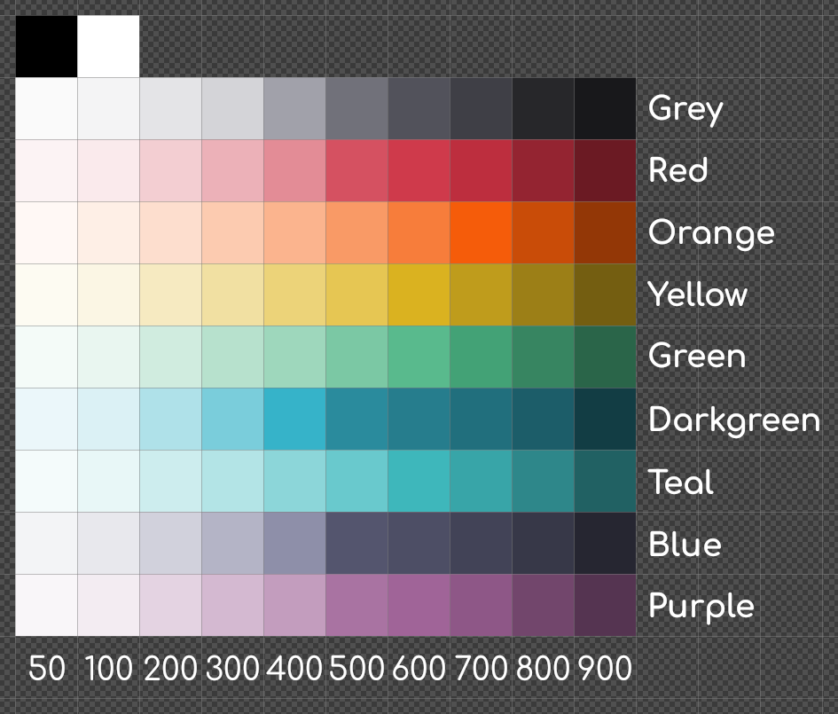

= dRCM Palette

Palette with 92 colors total that can be used for https://devrant.com[devRant]-oriented graphics. It contains: black, white, 9 hues times 10 shades each.

* xref:drcm-palette.gpl[GIMP Palette] -- file that can be imported into graphics editor:

** https://docs.gimp.org/en/gimp-palette-dialog.html#gimp-palette-import[GIMP]
** https://inkscape-manuals.readthedocs.io/en/latest/palette.html[Inkscape]

* xref:drcm-palette.svg[SVG Palette Layout]
